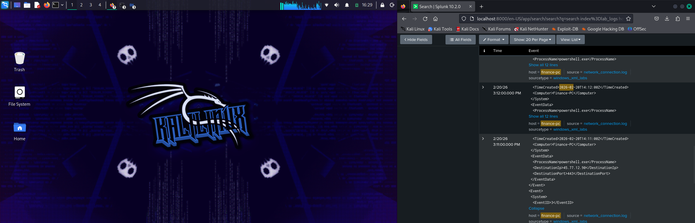

# PowerShell Beaconing Lab

## Scenario
A PowerShell process executed on host `finance-pc` and made repeated outbound HTTPS connections to an external IP.
We are simulating detection of command-and-control behavior using Windows logs ingested into Splunk.

## Logs / Evidence

Here’s what we found in Splunk:

| _time           | EventID | ProcessName    | DestinationIp   |
|-----------------|---------|----------------|----------------|
| 14:10           | 4688    | powershell.exe | -              |
| 14:11           | 3       | powershell.exe | 45.77.12.90    |
| 14:12           | 3       | powershell.exe | 45.77.12.90    |
| 14:13           | 3       | powershell.exe | 45.77.12.90    |

### Screenshot

## Analysis
- 14:10 — PowerShell executed (EventID 4688). Could be legitimate, but context is suspicious.  
- 14:11 — Network connection initiated (EventID 3) to external IP 45.77.12.90 over port 443.  
- 14:12–14:15 — Repeated outbound connections every minute. Pattern indicates beaconing.  
- Correlation shows that the PowerShell process is controlling repeated network activity. Typical of malware C2.  
- Port 443 alone is normal, but repeated and automated pattern is suspicious.
  
- Timeline reconstruction & SOC investigation methodology
